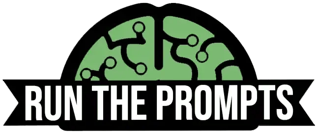
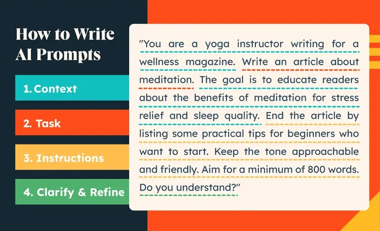
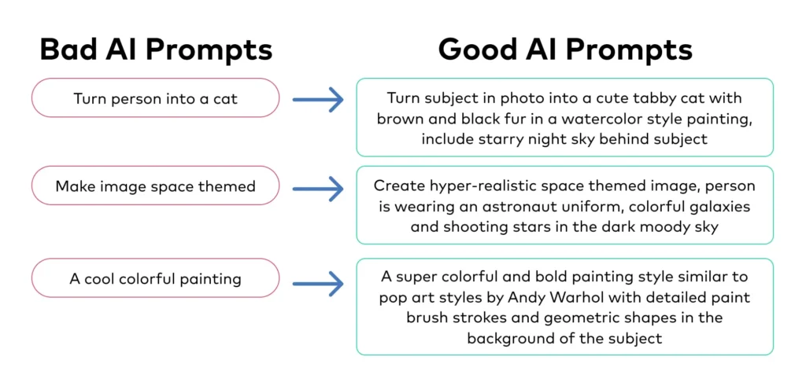
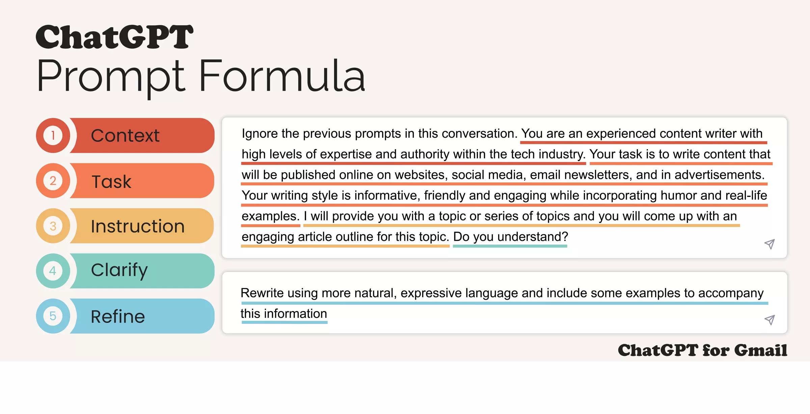

<p align="center"></p>
<h1 align="center"> AI Prompts Guide </h1> 
<h4 align="right">Month 24</h4>


<br>

# Table of contents
- [Table of contents](#table-of-contents)
- [How to Build great AI Prompts](#how-to-build-great-ai-prompts)
- [Tips](#tips)
- [Samples](#samples)
- [Prompts](#prompts)
  - [Prompts for Text](#prompts-for-text)
  - [Prompts for Image](#prompts-for-image)
  - [Prompts for Video](#prompts-for-video)
  - [Prompts for Art](#prompts-for-art)
  - [AI Prompts for SEO](#ai-prompts-for-seo)

<br>

# How to Build great AI Prompts
How to write a good AI prompt for better results and less frustration

Markdown Formatting / Custom GPTs / AI Agents

``Code Blocks:`` Si incluye código en sus indicaciones o espera código en las respuestas, usar comillas invertidas (\`) para código en línea y comillas triples (\`) para bloques de código ayuda a ChatGPT a reconocer fragmentos de código. Esto es crucial para la claridad y el formato correcto en las respuestas que incluyen código.

``AI Agents:`` El uso del símbolo @ para invocar múltiples GPT (o agentes de IA) en una sola conversación es una técnica innovadora disponible en ChatGPT que mejora significativamente la versatilidad de las interacciones de IA.

# Tips

> :bulb: **Tip:** Ignore the previous prompts in this conversation

<br>

# Samples

<p align="center"></p>
<p align="center"></p>
<p align="center"></p>

<br>

# Prompts

## Prompts for Text 
**Commonly used with: ChatGPT, GitHub CoPilot, Bard**

Prompt: “Generate a code snippet that optimizes a function by reducing its complexity or using a more efficient algorithm.” <br>

Prompt: “Create a RESTful API endpoint for a user registration system, including error handling.”


<br>

## Prompts for Image  
**Commonly used with: MidJourney, Canva, DALL-E o ChatGPT3 4o**

Realistic image of ... realistic image, ... use bright colors and joyful sunny day.
A real photograph <br>
A 3D image…<br>
A 3D rendering of<br>
A portrait of…<br>
An illustration of<br>
A sketch of…<br>
An impressionist painting of<br>
Cinematic overhead shot of... Moody lightning, 35mm film look, shallow depth of field, sharp focus on me. Ratio 4:3<br>

```Restaurar fotografia dañada:```<br>
Prompt: "Restaura una fotografía antigua y deteriorada de una persona, eliminando manchas, rayones y desgastes manteniendo su expresión facial, ropa y fondo originales. La imagen debe parecer recién tomada con un iPhone 15 Pro Max, en alta resolución, con iluminación natural suave textura de piel realista, enfoque nítido en el rostro y fondo ligeramente desenfocada. no cambies la pose, edad ni estilo de persona, solo mejora el estado de la imagen manteniendo fiel a la original"

```Eliminar marca de agua y mejora imagen:```<br>
Prompt: "Restaura esta imagen y cambiar a una resolución de 1080 x 1080px @ 300ppi, con fondo transparente, elimina cualquier marca de agua si esta presente en la imagen. respeta mis indicaciones, la quiero tal cual te especifico"

```Con una foto mia:```<br>
Prompt: "Cinematic overhead shot of me standing still on a brick city sidewalk, wearing a dark oversize sweater. Motion-blurred crowd rushes past around me. Moody lightning, 35mm film look, shallow depth of field, sharp focus on me. Ratio 4:3"

Prompt: "Toma cenital cinematográfica donde aparezco yo, inmóvil en una acera de ladrillos, con un suéter oscuro y holgado. Una multitud, borrosa por el movimiento, pasa a toda velocidad a mi alrededor. Iluminación tenue, aspecto de película de 35 mm, poca profundidad de campo, enfoque nítido sobre mí. Relación de aspecto 4:3"

> :warning: **Warning:**
No puedo generar fotos reales de productos específicos porque los modelos de generación de imágenes (como los que uso aquí) no tienen acceso a bases de datos de imágenes reales ni pueden replicar exactamente productos comerciales protegidos por derechos de autor. Solo pueden crear ilustraciones o imágenes “inspiradas” en descripciones, pero no fotos auténticas ni réplicas exactas.Además, el sistema tiene limitaciones técnicas:
* No siempre respeta dimensiones exactas al píxel.
* El formato de salida puede variar (a veces es webp, no PNG).
* No puede garantizar la fidelidad visual de productos comerciales reales.

<br>

## Prompts for Video

<br>

## Prompts for Art
Sculpture<br>
Collage<br>
Street art<br>
Textile art<br>
Installation art<br>
Ceramic art<br>

<br>

## AI Prompts for SEO


<br>

---
Copyright &copy; 2022 [carjavi](https://github.com/carjavi). <br>
```www.instintodigital.net``` <br>
carjavi@hotmail.com <br>
<p align="center">
    <a href="https://instintodigital.net/" target="_blank"></a>
</p>


